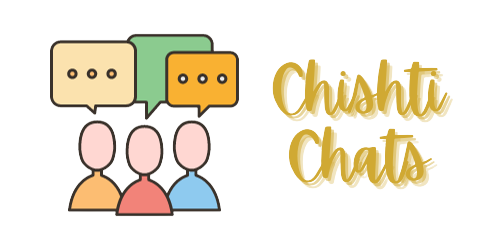

<h1 align="center">Contribute in Chishti Chats</h1>

<i>Chat Forum for Khwaja Moinuddin Chishti Language Univeristy</i>

# About Chishti Chats
Chishti Chats is a student-centric forum developed to foster a vibrant community within Khwaja Moinuddin Chishti Language University. Our platform aims to facilitate seamless communication, knowledge sharing, and collaboration among students and faculty members. With an intuitive interface, Chishti Chats offers a centralized space for students to engage in discussions, share valuable insights, create meaningful connections, and enhance their academic journey.

## Environment Setup

Refer to the [readme](README.md) file for environment setup.

## Contribution Guidelines

Contributions are always welcome! 

* Open an issue for any feature request or bug report.
* Fork the repository and create a new branch for your contribution.
* Send a pull request with your changes.
* Make sure to add the issue number in the pull request description.
* If you are new to open source, you can refer to [this](https://www.digitalocean.com/community/tutorial_series/an-introduction-to-open-source) tutorial series by DigitalOcean to get started.